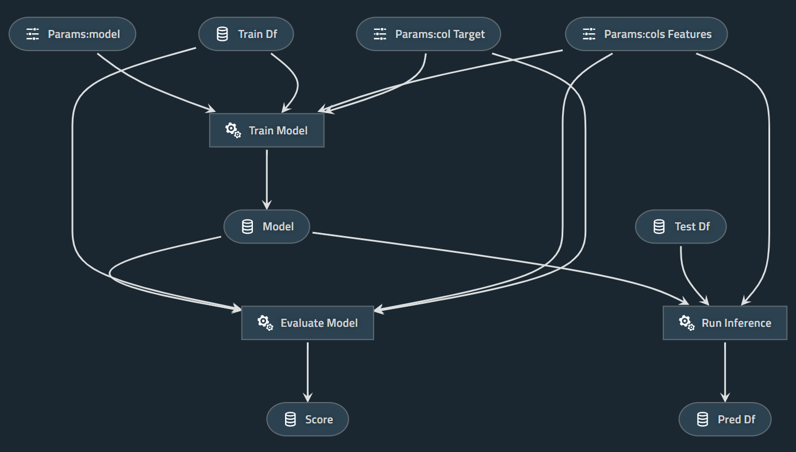

# Kedro Scikit-learn

## This project works with Kedro 0.16.x only.
## Please use [kedro-starters-sklearn](https://github.com/Minyus/kedro-starters-sklearn) which works with Kedro 0.17.x.

A simple example project using Kedro and Scikit-learn

<p align="center">

Pipeline visualized by Kedro-viz
</p>

## How to run:

### 1. Install dependencies

```bash
$ pip install kedro scikit-learn pandas kedro-viz 
```

Note: `kedro-viz` is optional.

### 2. Clone this repository and cd into it

```bash
$ git clone https://github.com/Minyus/kedro_sklearn.git
$ cd kedro_sklearn
```

### 3. Go to next step to use the Iris datasets included in this project. 

Optionally, you may dowonload another dataset such as [Kaggle Titanic](https://www.kaggle.com/c/titanic/data), replace  `train.csv` and `test.csv` in `data/input` directory, and modify `base/parameters.yml` to set parameters appropriate for the dataset.

### 4. Run `main.py`

```bash
$ python main.py
```

Alternatively, Kedro CLI can be used to run.

```bash
$ kedro run
```

## Kedro catalog configuration

In this example project, the Kedro catalog is configured in Python code at `src/catalogs/catalog.py` using a hook at `src/hooks/add_catalog_dict.py` so users can get benefit from linting/auto-completion by the Python IDE. It is also possible to configure in `catalog.yml` as well.


## Simplified Kedro project template

This project was created from the GitHub template repository at https://github.com/Minyus/kedro_template

To use for a new project, fork the template repository and hit `Use this template` button next to `Clone or download`.

<p align="center">

</p>
